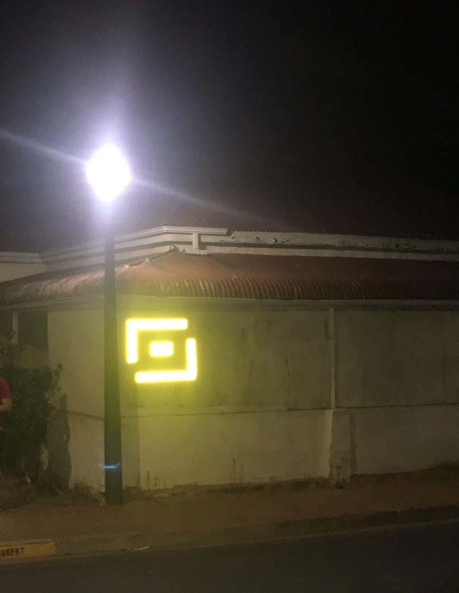
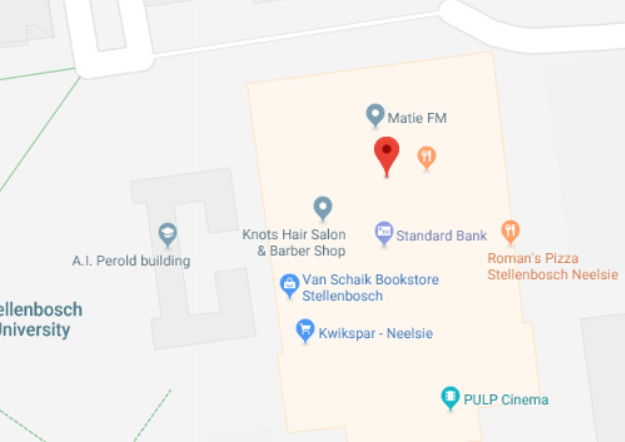
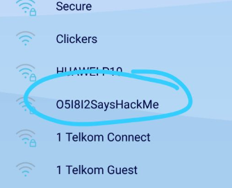

##  o5i8i2 Summary 
> last modified at 11:29 17/05/2018

### Binary Stickers
**First known sighting : 24 April 2018**

Multiple stickers containing a sequence of binary strings were placed around campus.
The o5i8i2 logo (see image below) appears above the text. All the stickers seem to 
contain exactly the same numbers. Converting the values to ascii yields the following 
link: [`bit.ly/2IJOvaz`](http://bit.ly/2IJOvaz)

<!--  -->
`TODO: add image`

Stickers were found at:
+ CS Honours Lab
+ Direction sign in front of Visual Arts building
+ Neelsie top floor wall socket
+ Neelsie bottom floor supply cupboard (inside)
+ Engineering Building (many many many)

`TODO: add links to images`

### Location website
The link leads to [`https://osiris-loacation.herokuapp.com`](https://osiris-loacation.herokuapp.com). 
I have made the assumption that the incorrect spelling of "location" is just an innocent mistake. 
The website contains only the o5i8i2 logo and the following text : 

> Hello...
> You know what you're looking for:
> -33.931442, 18.864543
> OR
> -33.938889, 18,860970

Interestingly, the title of the page is "o5i8i2 says hello". This is the first time we
encounter the name. It was not immediately obvious to me, but o5i8i2 is leet for 
"Osiris".

### Coordinates
The coordinates point to 
[Dorp Street](https://www.google.com/maps/place/33%C2%B055'53.2%22S+18%C2%B051'52.4%22E/@-33.931442,18.864543,17z/data=!3m1!4b1!4m5!3m4!1s0x0:0x0!8m2!3d-33.931442!4d18.864543) 
and [Joubert Street](https://www.google.com/maps/place/33%C2%B055'53.2%22S+18%C2%B051'52.4%22E/@-33.931442,18.864543,17z/data=!3m1!4b1!4m5!3m4!1s0x0:0x0!8m2!3d-33.931442!4d18.864543) 
respectively.
The following clues were found there:

##### Dorp Street


Converting the binary string to ascii, we get:
> Recruiting: all potential agents willing and able-minded to help fight for our cause. If interested, contact Zero-Five-One-Eight-One-Two at: 
http://bit.ly/2IJOvaz

which leads to [`o5i8i2.herokuapp.com`](https://o5i8i2.herokuapp.com).

##### Joubert Street


Scanning the QR code, we get a url which leads to [`o5i8i2.herokuapp.com`](https://o5i8i2.herokuapp.com).


**Sidenote:** *Both of these clues were posted on Reddit, 
([Dorp](https://www.reddit.com/r/southafrica/comments/8ej13k/saw_the_stellenbosch_post_about_the_weird_glowing/), 
[Joubert](https://www.reddit.com/r/southafrica/comments/8e18sp/stellies_redditors_saw_this_on_joubert_str_last/)). Interestingly, the original
poster of the Joubert Street clue , `/u/RansackTheCity`, only created an account on 
March 16 2018 - roughly one month before the challenge began. Since then, this has been
the only post they have ever made.*

### The o5i8i2 website
We are greeted by an [audio recording](audio/?). We are then presented with 
a modified version  of 2048. As soon as we start playing, a timer
counts down from 2 minutes. The game is won by achieving a score 
of 512 before the timer reaches 0.

Doing so will grant you access to a [registration page](https://o5i8i2.herokuapp.com/#/register).

### Cryptography puzzle #1
After registration, the website redirects you to a page with the following numbers:
```text
57 22 9 26 __ 47 26 16 15 19 26
57 22 9 26 95 __ 60 10 18 29 26 13 12
44 30 18 26 __ 43 22 18 26
38 16 10 __ 52 17 16 8 __ 40 23 26 17 

84 77 72 77 78 71 72 70 77 79 75 79
84 77 72 77 78 71 72 70 77 79 79 75
84 77 72 77 78 71 72 70 77 79 78 71
84 77 72 77 78 71 72 70 77 79 74 77
84 77 72 77 78 71 72 70 77 79 72 72
```
> where "`__`" represents a space 

Below the numbers was the phrase "Inspect things a little closer" and a text field with
placeholder "Completed algorithm".

"Inspect" was a reference to the browser inspection panel. Inspecting the source code for
the webpage revealed a comment, that when reshuffled by line produced:

```python
print(' __   _____    _____  _____   _____  ______     _____    ___        _____  _____  __   _____ ')
print('/  | / __  \ _|____ ||  _  | / __  \|___  /    |  _  |  /   |      / __  \|  _  |/  | |  _  |')
print("`| | `' / /'(_)   / /| |/' | `' / /'   / /_____| |/' | / /| |______`' / /'| |/' |`| |  \ V / ")
print(' | |   / /        \ \|  /| |   / /    / /______|  /| |/ /_| |______| / /  |  /| | | |  / _ \ ')
print('_| |_./ /___ _.___/ /\ |_/ / ./ /___./ /       \ |_/ /\___  |      ./ /___\ |_/ /_| |_| |_| |')
print('\___/\_____/(_)____/  \___/  \_____/\_/         \___/     |_/      \_____/ \___/ \___/\_____/')
```

This date and time alone did not lead to anything. The rest of the clue had to have
been in the list of numbers.

Decoding those required subtracting each value from 127 and converting the result to ascii:

```javascript
console.log(String.fromCharCode(...[
	57,22,9,26,95, //space
	47,26,16,15,19,26,117, //newline
	57,22,9,26,95,
	60,10,18,29,26,13,12,117,
	44,30,18,26,95,
	43,22,18,26,117,
	38,16,10,95,
	52,17,16,8,95,
	40,23,26,17,117,
	84,77,72,77,78,71,72,70,77,79,75,79,117,
	84,77,72,77,78,71,72,70,77,79,79,75,117,
	84,77,72,77,78,71,72,70,77,79,78,71,117,
	84,77,72,77,78,71,72,70,77,79,74,77,117,
	84,77,72,77,78,71,72,70,77,79,72,72,117
].map(x => 127 - x)))
```

**Output:**
```
Five People
Five Cumbers
Same Time
You Know When
+27218792040
+27218792004
+27218792018
+27218792052
+27218792077
```

Again, I assume 'Cumbers' is simply a mistake and that 'Numbers' was intended.

At this point, I called each of the numbers and got the exact same response each 
time. A recorded message would say "Our offices are currently closed. Please call 
again later." and a few seconds later a different voice "Thank you".

Not much happened until Friday 27 April.

### 000-000-000-000-000
After 12:30 on April 27, if you called any of the five numbers, they would read out a string
of the format `000-000-123-000-000`. Each phone number gave a different answer. Here is a 
list of the answers:
```text
271-000-000-000-000
000-818-000-000-000
000-000-047-000-000
000-000-000-002-000
000-000-000-000-812
```

Combining these, we get `271-818-047-002-812`. After entering this into the text field on the website,
we were taken to another page, where there was another audio file and a message saying o5i8i2 will 
be in contact with us. The countdown was set to end at 12:00 on the afternoon of Wednesday 2 May.

### You are the key
When the countdown ended, the following puzzle became available:

```text
You are the key

1805160202 1805160202 1806100217 111222 06 2002 15020211 16022517170604110201 0611 
180502 13251718 11061102 101211180517 1805160202 1806100217 251101 111222 18050224 
1602 18020909061104 1002 06 10 1502061104 1602130925210201 06 2002 181625200209090201 
1812 0220021624 152521082225180216 21121911181624 180502 250402112124 17021118 1002 
1812 0217182515090617050201 1119100216121917 1525170217 1203 12130216251806121117 251101 
2503180216 250909 1024 05251601 22121608 06 040218 1602130925210201 0618 17 2511 
12191816250402 1024 22121608 2517 09022501 010220020912130216 031216 180502 121706160617 
13161204162510 0617 22052518 21251825131909180201 180502 250402112124 03121622251601 1524 
2518 0902251718 25 010221250102 06 2002 15020211 22121608061104 031216 18050210 031216 
182202111824 03062002 2402251617 251101 18050617 0617 051222 18050224 1602132524 1002 
02200211 0603 180502 011219150902 26021612 18251708 0312162102 01061713121702 1203 1002 
09060802 18050224 0106171312170201 1203 21120909061117 251101 1012161806100216 
18050224 22060909 1102200216 10251125
```

We convert this to text by slicing each number (each an even length of digits) into two-digit
substrings and then two digit number to the corresponding number in the alphabet, 
e.g. `180516 -> (18,5,16) -> (REP)`. The entire string, converted:

```text
repbb repbb rfjbq klv f tb obbk pbyqqfdkba fk reb myqr kfkb jlkreq repbb 
rfjbq  yka klv rebx pb rbiifkd jb f j obfkd pbmiyuba f tb rpytbiiba rl btbpx 
oyuhvyrbp  ulskrpx reb ydbkux qbkr jb rl bqryoifqeba ksjbplsq oyqbq lc 
lmbpyrflkq yka  ycrbp yii jx eypa vlph f dbr pbmiyuba fr q yk lsrpydb jx vlph
```

Finally, we run this string through [quip-quip](https://quipquip.com) and get:

```text
three three times now i ve been reassigned in the past nine months three times and now they re telling me i m being replaced i ve travelled to 
every backwater country the agency sent me to established numerous bases of operations and after all my hard work i get replaced it s an 
outrage my work
```

Selecting numbers out the plaintext gives the following:
```text
33932500
```

Entering 33932500 into the website reveals the next similar puzzle, which had the following solution:
```text
18865400
```

Entering this solution into the website presented another countdown timer.

### O5I8I2SaysHackMe
Once the timer expired the following message was shown:
```text
‘REMOTE WIFI DECRYPTION FAILED...ON SITE ATTACK REQUIRED...HANDSHAKES TO OCCUR EVERY 30MINS FROM 4PM TO 6PM...FILE SERVED ON 172.24.1.1’
```

The previous solutions, when interpreted as latitude and longitude, point to the Neelsie:



A wifi AP was found, encrypted with WPA2:



An attempt was made to capture handshake packets, and an attempt to crack the password was made. It is unclear whether this was successful, however the password was provided on the WhatsApp group by Osiris.

```text
ON SITE ATTACK SUCCESSFUL; PASSWORD: dictionary1234 ;
```

<!-- MORE -->
